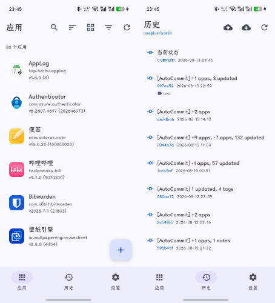
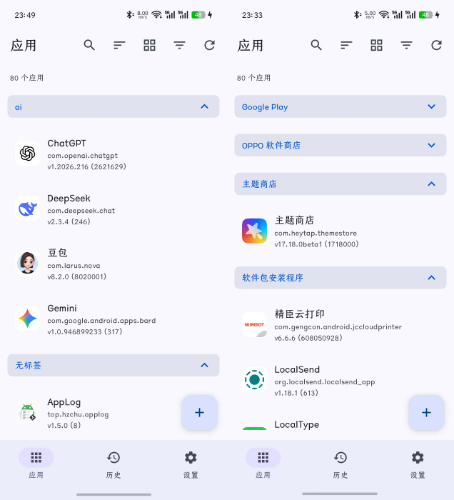
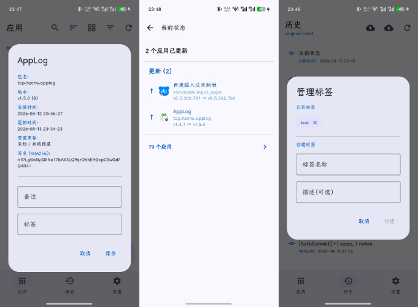

<a href="https://applog.hzchu.top/"></a>

---

AppLog 为设备上已安装的应用列表生成快照，把每次快照提交到本地 Git 仓库，并可推送到远程 Git 仓库。通过对比提交，可以追踪应用的安装、卸载、更新，以及用户输入的备注和标签的变化。


[](https://github.com/thun888/AppLog/actions/workflows/ci.yml)
[](https://github.com/thun888/AppLog/releases/latest)
[](https://github.com/thun888/AppLog/releases)
[](https://github.com/thun888/AppLog/blob/main/LICENSE)
[](https://github.com/thun888/AppLog/stargazers)

## 样式速览

<details>
<summary>点击展开</summary>







</details>

## 功能

<details>
<summary>点击展开</summary>

**应用快照**

- 通过 `PackageManager` 采集每个已安装应用的包名、应用名、版本号/版本代码、首次安装时间、最后更新时间、安装来源、系统/第三方类型、签名 SHA-256。
- 快照序列化为单文件 `apps_snapshot.txt`，一次提交保存一份完整清单。
- 提交作者默认 `AppLog <applog@local>`，可在设置中修改。

**变更追踪**

- 手动提交快照，自动生成提交信息（`[AutoCommit] +N apps, ...`），也可自定义。
- 历史页面分页列出提交，显示当前分支、未推送提交数和提交标签。
- 每个提交展示与父提交的差异：新增 / 移除 / 更新（版本或签名变化）/ 备注变化 / 标签变化。
- 历史页面首位的“当前状态”展示当前扫描结果相对 HEAD 的未提交差异。

**应用管理**

- 搜索：应用名 / 包名 / 备注。
- 排序：按名称、包名、安装时间、更新时间排序。
- 过滤：按标签或安装来源分组；过滤系统 / 第三方应用。
- 备注：每个应用可编辑备注和标签。
- 应用操作：打开、提取 APK 到下载目录、分享 APK、卸载。已知应用商店的安装来源可点击跳转到商店页面。

**Git 集成**

- Push / Pull / Force Push / Force Pull，HTTPS 认证，用户名 + 密码/Token。
- 远程凭据通过 `EncryptedSharedPreferences` 加密存储。
- 分支管理：切换、新建（含孤儿分支）、删除。
- 提交标签：创建 / 删除；远程已配置时自动同步，同步失败会回滚本地操作。

**通知**

- 监听应用安装 / 卸载事件（升级过程中的中间事件不计入），变更次数累计达到阈值（默认 5，可调 1–50）时发送通知提醒提交。事件只触发通知，不会自动提交。

</details>

## 快速上手

1. 从 [Releases](https://github.com/thun888/AppLog/releases) 下载安装 APK。
2. 首次启动填写引导表单：远程仓库 URL、用户名、密码/Token、初始分支名（必填）；Git 身份可选。
3. 主页点击浮动按钮扫描并提交快照；历史页面查看提交历史和差异。

> 分支可用作实现单仓库管理多设备。可按照`{厂商}/{型号}`来新建分支

## 快照文件格式

`apps_snapshot.txt` 每行一个应用，字段以 `|` 分隔（包名、应用名、备注、标签四个字段中的 `|` 转义为 `\|`）：

| 字段 | 含义 |
|---|---|
| 1 | 包名 |
| 2 | 应用名 |
| 3 | versionName |
| 4 | versionCode |
| 5 | 首次安装时间（毫秒） |
| 6 | 最后更新时间（毫秒） |
| 7 | 安装来源包名 |
| 8 | 类型：`SYSTEM` / `THIRD_PARTY` |
| 9 | 签名 SHA-256（Base64） |
| 10 | 备注 |
| 11 | 标签（逗号分隔，整理后存储） |


## 权限

| 权限 | 用途 |
|---|---|
| `QUERY_ALL_PACKAGES` | 读取已安装应用列表 |
| `POST_NOTIFICATIONS` | 变更提醒通知 |
| `INTERNET` / `ACCESS_NETWORK_STATE` | Git 推送和拉取所必须的网络权限 |

## 构建

环境：JDK 25（CI 使用 Temurin 25）、Android SDK Platform 37.0。项目使用 AGP 9.3.1、Kotlin 2.4.10。

```
./gradlew assembleDebug     # 构建 debug APK
./gradlew testDebugUnitTest # 运行单元测试
```


## 技术栈

- Kotlin / Jetpack Compose (Material 3)，minSdk 24（Android 7.0+），compileSdk / targetSdk 37
- [JGit](https://www.eclipse.org/jgit/) 6.9：本地 Git 仓库操作
- androidx.security:security-crypto：远程凭据加密存储
- Coil（应用图标加载）、TinyPinyin（拼音排序与索引）、SLF4J（JGit 日志）

感谢以上项目❤️

## License

[Apache License 2.0](LICENSE)
